# 🤖 CSV‑to‑Model Agent Pipeline

[](./.github/workflows/ci.yml)
[](https://www.python.org/)
[](#license)

**Turn any tabular dataset into a deployable machine‑learning model & narrative report** using a **graph of cooperating AI agents** built with **LangGraph**.

## Quick Start

### Prerequisites
- Python 3.9 or higher
- A Groq API key (or use our provided hashed key for testing)

### Installation & Setup

1. **Clone the repository:**
   ```bash
   https://github.com/siddhm11/ml_agents.git
   cd ml_agents
   ```

2. **Create and activate virtual environment:**
   ```bash
   python -m venv venv
   venv\Scripts\activate
   ```

3. **Install dependencies:**
   ```bash
   pip install -r requirements.txt
   ```

4. **Set up your Groq API key:**
   
   **Option A: Use your own API key**
   - Get your API key from [Groq Console](https://console.groq.com/)
   - Open the Python script for the agent you want to use:
     - **mlc2.py (General Agent):** Find `agent = CSVMLAgent(groq_api_key="GROQ_API_KEY from link")`
     - **reg.py (Regression Model):** Find `agent = RegressionSpecialistAgent(groq_api_key="//")`
     - **classi.py (Classification Model):** Find `agent = ClassificationSpecialistAgent(groq_api_key="API")`
     - **both.py (Dual Agent):** Find `analyzer = DualAgentAnalyzer(groq_api_key=GROQ_API_KEY)`
     - **ts_pred.py (Time Series):** Find `agent = TimeSeriesAgent(groq_api_key="your_key_here")`
   - Replace the placeholder with your actual API key

### Running the Agents

Choose which agent you want to use based on your problem type:

**Available Agents:**
- **mlc2.py** - General ML Agent (auto-detects problem type)
- **reg.py** - Regression Model Agent  
- **classi.py** - Classification Model Agent
- **ts_pred.py** - Time Series Classification Agent
- **both.py** - Dual Agent Analyzer

**Run Commands:**
```bash
python agents/mlc2.py      # General agent
python agents/reg.py       # Regression specialist
python agents/classi.py    # Classification specialist  
python agents/ts_pred.py   # Time series agent
python agents/both.py      # Dual agent analyzer depending on data
```

---

## AI Agent for Automated ML Analysis

### Overview

This repository contains an intelligent AI agent designed to automate the process of machine learning analysis on CSV datasets. Leveraging advanced AI techniques and a robust technology stack, this agent can autonomously identify problem types (classification or regression), perform data quality assessments, conduct feature engineering, train various machine learning models, and provide comprehensive insights and recommendations.

### What are AI Agents?

AI agents are software systems that use artificial intelligence to pursue goals and complete tasks autonomously on behalf of users. They are designed to perceive their environment, make decisions, and take actions to achieve a specific objective, often learning and adapting over time.

**Analogy: The Self-Driving Car**

Think of an AI agent as a self-driving car. You provide it with a high-level goal (e.g., "analyze this CSV data"), and it autonomously handles all the complex sub-tasks involved in reaching that goal. Just as a self-driving car uses various **tools** (sensors, GPS, engine controls) to navigate and interact with the road, our AI agent utilizes its own set of tools (like data processing libraries, machine learning algorithms, and an LLM) to interact with and transform data.

Key characteristics of our AI Agent:

*   **Autonomy:** Operates independently without constant human intervention.
*   **Perception:** Gathers information from the CSV data (like car sensors).
*   **Reasoning:** Processes information and makes intelligent decisions (like the car's navigation system).
*   **Action & Tools:** Performs tasks or interacts with the data using specific tools (like running a regression model or performing feature scaling).
*   **Learning/Adaptation:** Improves performance over time based on experience and new data.

![AI Agent Self-Driving Car Analogy]

## Technology Stack

Our AI agent is built upon a powerful and carefully selected technology stack:

*   **LangGraph:** A stateful orchestration framework that enables the agent to manage complex, multi-step workflows and maintain context throughout the analysis process.
*   **scikit-learn:** A comprehensive machine learning library providing a wide array of algorithms for classification, regression, preprocessing, and model selection.
*   **XGBoost:** An optimized distributed gradient boosting library designed for speed and performance, used for high-performance machine learning models.
*   **pandas:** A fast, powerful, flexible, and easy-to-use open-source data analysis and manipulation tool, built on top of the Python programming language.
*   **NumPy:** The fundamental package for scientific computing with Python, providing support for large, multi-dimensional arrays and matrices, along with a large collection of high-level mathematical functions.


### Why This Stack?

We rigorously evaluated multiple frameworks and libraries to select a stack that offers the best balance of performance, flexibility, and reliability for building autonomous AI agents. LangGraph provides the robust orchestration layer necessary for complex, stateful workflows, while scikit-learn, XGBoost, pandas, and NumPy offer powerful and efficient tools for data manipulation and machine learning.

This combination allows our agent to:

*   **Handle Complex Workflows:** Seamlessly manage multi-stage data analysis.
*   **Ensure Reliability:** Maintain state and recover from potential issues.
*   **Optimize Performance:** Leverage highly optimized ML libraries for speed and accuracy.
*   **Provide Flexibility:** Adapt to diverse datasets and problem types.

## How Our Agents Work (High-Level Workflow)

Our AI agent follows an intelligent, graph-based workflow to process data and generate insights:

1.  **Data Ingestion:** The agent loads and validates the CSV file, automatically detecting encoding and structure.
2.  **Problem Identification:** Using an LLM, the agent intelligently determines the optimal machine learning problem type (classification or regression) for the given dataset.
3.  **Feature Engineering:** It intelligently selects and transforms features to optimize model performance.
4.  **Model Training:** Multiple algorithms are trained and evaluated to find the best performer for the identified problem type.
5.  **Evaluation & Recommendation:** The agent analyzes the results, selects the optimal model, and provides detailed explanations and recommendations.


## Key Features & Capabilities

*   **Intelligent CSV Analysis:** Automatically analyzes CSV data, identifies patterns, and selects optimal ML approaches.
*   **Adaptive Model Selection:** Dynamically chooses the best algorithms based on data characteristics.
*   **Automated Feature Engineering:** Creates and selects optimal features from raw data.
*   **Specialized Processing Agents:** Dedicated agents for classification and regression tasks with domain-specific optimizations.
*   **LLM-Enhanced Decision Making:** Leverages large language models for intelligent decisions about data processing and model selection.
*   **Comprehensive Reporting:** Generates detailed analysis and recommendations, explaining the reasoning behind each decision.

## Available Agent Types

### 1. General ML Agent (`mlc2.py`)
The main agent that automatically detects whether your problem is classification or regression and applies the appropriate techniques.

### 2. Regression Specialist Agent (`reg.py`)
Optimized specifically for regression tasks with specialized algorithms and evaluation metrics.

### 3. Classification Specialist Agent (`classi.py`)
Tailored for classification problems with appropriate preprocessing and model selection.

### 4. Time Series Prediction Agent (`ts_pred.py`)
Specialized for temporal data analysis and forecasting tasks.

## Project Structure

```
agents/
├── mlc2.py          # Core CSVMLAgent class and LangGraph workflow
├── reg.py           # RegressionSpecialistAgent
├── classi.py        # ClassificationSpecialistAgent
├── ts_pred.py      # Time Series Prediction Agent
└── requirements.txt # Dependencies
```

## Workflow Visualization

```mermaid
flowchart TD
    %% ========== INGESTION ==========
    subgraph "🗂 Ingestion & Inspection"
        A1[csv_loader_node]:::core --> A2[initial_inspection_node]:::core
        A2 --> A3[data_quality_assessment_node]:::core
    end

    %% ========== SCOPING ==========
    subgraph "🔍 Problem Scoping"
        A3 --> B1[problem_identification_node]:::llm
        B1 --> B2{task type?}:::decision
    end

    %% ========== FEATURES ==========
    subgraph "🛠 Feature Design"
        B2 --> C1[feature_analysis_node]:::llm
        C1 --> C2[feature_engineering_node]:::core
    end

    %% ========== STRATEGY ==========
    subgraph "🧠 Strategy Synthesis"
        C2 --> D1[algorithm_recommendation_node]:::llm
        D1 --> D2[preprocessing_strategy_node]:::llm
    end

    %% ========== TRAIN ==========
    subgraph "🏋️ Training & Selection"
        D2 --> E1[model_training_node]:::core
    end

    %% ========== EVALUATE ==========
    subgraph "📈 Evaluation & Report"
        E1 --> F1[evaluation_analysis_node]:::llm
        F1 --> G1[final_recommendation_node]:::llm
    end

    classDef llm fill:#ffe6ff,stroke:#660066,stroke-width:1px
    classDef core fill:#e6f7ff,stroke:#004d99,stroke-width:1px
    classDef decision fill:#fff5cc,stroke:#806600,stroke-width:1px
    class A1,A2,A3,C2,E1 core
    class B1,C1,D1,D2,F1,G1 llm
    class B2 decision
```



## How It Works

This is not a simple linear script but an event-driven, stateful AI agent system built on LangGraph. The agents work by:

1. **Instantiating the Agent:** Choose the appropriate agent based on your task or use the general agent for auto-detection.
2. **Providing Input:** Initialize the agent with the path to your CSV file.
3. **Executing the Workflow:** The agent, powered by LangGraph, takes over and autonomously guides the analysis process through its intelligent workflow, making decisions and performing tasks at each step.

Essentially, you give the agent its mission (the CSV file), and it handles all the complex, intelligent work behind the scenes to deliver the insights you need.

## Troubleshooting

**Common Installation Issues:**
- If you encounter permission errors during installation, try running your terminal as administrator
- For Cython-related errors, try: `pip install --upgrade pip setuptools wheel`
- If packages fail to install, use: `pip install --user <package_name>`

**API Key Issues:**
- Ensure your Groq API key is properly set as an environment variable
- The demo key has usage limitations - get your own key for production use

## Contributing

We welcome contributions! Please feel free to submit pull requests or open issues for any bugs or feature requests.

## License

This project is licensed under the MIT License - see the LICENSE file for details.
